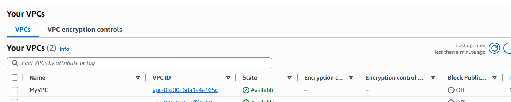
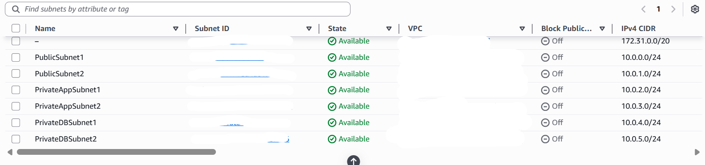

# Highly-Available-3-Tier-WordPress-Deployment-using-AWS-Services

This project focuses on deploying a WordPress website using a traditional 3-tier architecture on AWS. Instead of putting everything on a single server, the system is split into three layers: the presentation layer, the application layer, and the database layer.

The main idea behind this project was to simulate how an actual production-grade web application is deployed in the cloud. By separating concerns and distributing components across multiple services, we reduce single points of failure and make the system easier to scale and maintain. The setup uses AWS services like VPC, EC2, RDS, EFS, and ALB to build a system where users can access a WordPress website through a load balancer, while the backend and database remain protected inside private subnets.

# Features

This project includes several important features that make it closer to a real-world deployment:

- Multi-AZ deployment to improve availability and fault tolerance
- Clear separation between public and private subnets
- Application Load Balancer to distribute incoming traffic
- EC2 instances running WordPress in private subnets
- Amazon RDS (MySQL) for managed and reliable database storage
- Elastic File System (EFS) for shared storage across instances
- NAT Gateways to allow secure outbound internet access
- Security Groups to control traffic between different layers
- Bastion host setup for secure SSH access to private instances
- Scalable design that can be extended using Auto Scaling

# Architecture / How It Works

The architecture is designed in a way that separates concerns and keeps sensitive components secure. At the base level, a VPC (Virtual Private Cloud) is created with the CIDR block 10.0.0.0/16. This acts as the network boundary for the entire project. Inside the VPC, multiple subnets are created across two availability zones to ensure high availability.

- 2 Public Subnets (for ALB and NAT Gateways)
- 2 Private App Subnets (for EC2 instances)
- 2 Private DB Subnets (for RDS)

The Internet Gateway (IGW) is attached to the VPC to allow resources in public subnets to communicate with the internet. Meanwhile, private subnets do not have direct internet access. Instead, they use NAT Gateways placed in public subnets to access external resources securely (like downloading packages or updates).

The Application Load Balancer (ALB) sits in the public subnets and acts as the entry point for users. When someone opens the website, the request hits the ALB, which then forwards it to one of the EC2 instances in the private subnets.

The application layer consists of EC2 instances running Apache, PHP, and WordPress. These instances are not directly exposed to the internet, which improves security. Instead, they only accept traffic from the ALB.

To make sure all EC2 instances serve the same content, EFS (Elastic File System) is used. It is mounted on all EC2 instances so that uploaded files, themes, and plugins are shared across servers.

The database layer uses Amazon RDS (MySQL), which is deployed in private subnets. It is not publicly accessible and can only be accessed by the application layer through a security group rule.

Security Groups act like firewalls between layers:

- ALB → accepts traffic from the internet
- EC2 → accepts traffic only from ALB
- RDS → accepts traffic only from EC2
- EFS → allows NFS access from EC2

This layered design ensures that even if one part is exposed, the rest of the system remains protected.

# Setup Instructions

**#1: Networking Setup -**

Create a **VPC (10.0.0.0/16)** with DNS hostnames enabled, then set up subnets across multiple AZs for availability.

* **2 public subnets**
* **4 private subnets** (app + DB)
* Attach **Internet Gateway (IGW)**
* Route tables: Public → IGW, Private → NAT
This forms the basic, secure network foundation.

**#2:NAT Gateway & Security Groups -**
Next, set up internet access and secure communication between components. Allocate **2 Elastic IPs** and create **2 NAT Gateways** (one in each AZ) to provide outbound internet access for private subnets. Update the private route tables to route traffic through these NAT Gateways. Then configure Security Groups to control traffic flow:

* **ALB SG** → allow HTTP/HTTPS from anywhere
* **Web Server SG** → allow traffic only from ALB
* **DB SG** → allow MySQL (3306) from web servers
* **EFS SG** → allow NFS (2049) from web servers
* **SSH SG** → allow SSH only from your IP
This ensures secure and controlled communication across all layers.

**#3: Database & Storage Setup -**
Now configure persistent storage and the database layer. Create a **DB Subnet Group** using the private DB subnets, then launch an **RDS MySQL** instance with public access disabled and strong credentials to keep it secure.

Next, set up shared storage by creating an **EFS file system** and attaching it to the private app subnets, ensuring security groups allow NFS (2049) access from web servers.

RDS handles backups and patching automatically, while EFS provides scalable shared storage across instances.

**#4:Compute Setup (EC2 + WordPress)-**

Next, launch and configure the compute layer. Start with a **temporary bastion host** in a public subnet to securely access private resources via SSH (PuTTY or terminal).

* Install **Apache, PHP, MySQL client**
* Mount **EFS** to `/var/www/html`
* Download and configure **WordPress**

Then deploy the application servers by launching **two EC2 instances in private subnets**. Use a **user-data script** to automate setup so everything installs and configures on startup.

* Auto-install required packages
* Mount EFS during boot
* Configure environment

During setup, complete key tasks like setting Apache permissions, editing `wp-config.php`, and connecting WordPress to the **RDS MySQL** database. This step activates the application layer.

